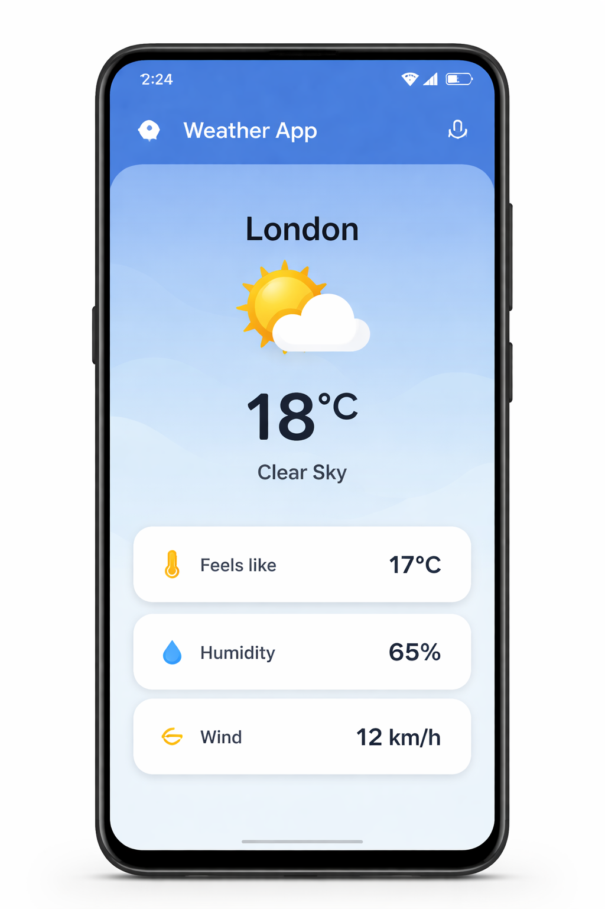

# Weather / News API Android App

## Project Overview
This Android application fetches real-time weather data from a public API and displays it in the app.

## Features
- Fetch data from REST API
- Show weather temperature
- Loading and error handling
- Simple UI

## Technologies Used
- Kotlin
- Android Studio
- Retrofit
- REST API

## Screenshot

## How to Run
1. Clone this repository
2. Open in Android Studio
3. Add your API key
4. Run the application
